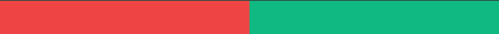

## INITIALISATION PROJET REACT AVEC NPM

- npx create-react-app burger-home 

## INSTALLER TAILWIND CSS mode POSTCSS

- npm i -g postcss-cli 
- npm install -D tailwindcss postcss autoprefixer
- npx tailwindcss init -p // -p pour creer postcss.config.css

- /** @type {import('tailwindcss').Config} */

module.exports = {
  content: ['./src/**/*.{html,js}',
            './pages/**/*.{html,js}',
            './components/**/*.{html,js}',], //ne pas oublier d'ajouter les liens pour que les css se mettent en place
  presets: [],

Dans **src/index.css**

@tailwind base;
@tailwind components;
@tailwind utilities;

## App.js 

- Creer une structure react : commande "rfc"

import React from 'react'

export default function App() {
  return (
    
App

  )
}

## RENITIALISER LE FICHIER TAILWIND.CONFIG.js COMPLET

- npx tailwindcss-cli@latest init --full

permet de developper une maquette tres strict et de mieux paufiner

## CREER UN ROUTER ET L'IMPORTER AU NIVEAU DE APP.JS
- import Router from './Router'
ou 
- Au niveau de App() on utilise la balise <Router> et ça importera automatiquement

- Au niveau de src/ on va creer un fichier Router.js

# EXTENSION REACT pour coder plus vite
- ES7 React
- Tailwind CSS Intellephense

# React-Router-dom error
Can't resolve 'react-router-dom'
Failed to compile.
Cette independace n'existe pas dans package.json

# INSTALLATION REACT ROUTER DOM
- npm i react-router-dom
- Verifier dans package.json : "react-router-dom": "^6.23.0",

Pour prendre en compte les composant ex:Switch mnt **Routes** et *Route* il faut : utiliser ***BrowserRouter***
<BrowserRouter>
  <Routes>
    <Route exact path="/">
      <HomePage/>
    </Route>
  </Routes>
</BrowserRouter>

- Ancienne syntaxe : 

import { BrowserRouter as Router, Switch, Route, Link } from "react-router-dom";
<Switch>
    <Route path="/" element={<HomePage/>} />
</Switch>

- Nouvelle Syntaxe : 

import { BrowserRouter as Router, Routes, Route, Link } from "react-router-dom";

<Routes>
    <Route path="/" element={<HomePage/>} />
</Routes>

## AJOUTER UNE COULEUR DANS TAILWIND.CONFIG.JS 
colors: {
      transparent: 'transparent',
      current: 'currentColor',

    'primary' : '#cccccc',

- IL FAUT REDEMARRER LE SERVEUR NPM

## AJOUTER UN BACKROUND REPEAT EN REACT

 

## FAIRE AFFICHER LE CONTENU D'UN COMPOSANT DANS HEROTOP()

il faut utiliser un props *children* en paramètre :

**Container.js**

export default function Container({children}) {
  return (
    

        {children} //cela va permettre d'afficher dans la page principale le contenu dans les balises <Container>....</Container>
    

  )
}

## IMPORTER UN LOGO DANS HEADER.JS

- import Logo from '../../../medias/svg/Logo-burger-house.svg'

    // permet rendre le container de type flex les items centrés verticalement et justifé entre eux 
    
 
        
    

  
## PARAMETRER UNE TYPOLOGIE POLICE ECRITURE

# Index.css

/* Font Family Roboto */
@import url('https://fonts.googleapis.com/css2?family=Roboto:wght@400;500;700&display=swap');
/* Font Alfa Slab One */
@import url('https://fonts.googleapis.com/css2?family=Alfa+Slab+One&display=swap');

body{
    font-family: 'Roboto';
}

# Tailwind.config.js

  fontFamily: {
      **'secondary' : ['"Alfa Slab One"'],**
      sans: [
        'ui-sans-serif',
        'system-ui',
        '-apple-system',
        
## INSTALLER UN COMPOSANT CAROUSEL DEPUIS NPM
- npm i react-alice-carousel

## DESINSTALLER UN COMPOSANT 

- npm uninstall react-alice-carousel
  
## Intégrer des classes de type formulaire dans Tailwind

- npm install @tailwindcss/forms

- Il  faut rajouter un nouveau plugin a notre tailwind.config.js

**const plugin = require('tailwindcss/plugin')** - en haut de page

module.exports = {
  ...

  //en bas de la page il faut ajouter le require 
    plugins: [
    **require('@tailwindcss/forms')**
  ],
}

## Installer la librairie Heroicone

-  npm install @heroicons/react 

Cela permetra d'utiliser directement les svg a travers des balises component

